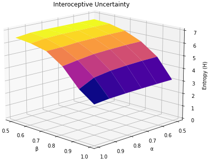
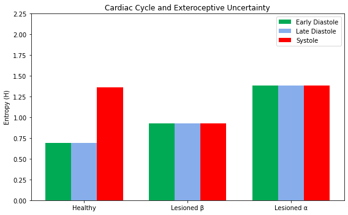
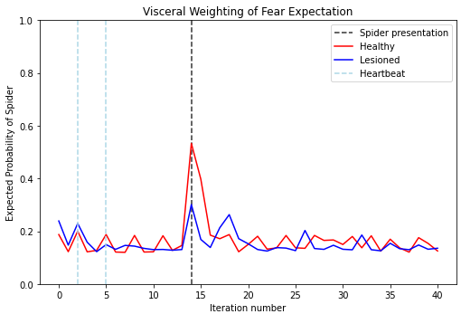
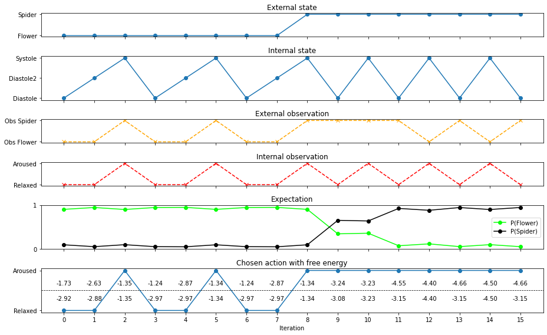

# Affective Computing & Natural Interaction project: Interoceptive Active Inference to Simulate Cardiac–Perceptual Coupling
### This is a project for the [Affective Computing](https://www.unimi.it/it/corsi/insegnamenti-dei-corsi-di-laurea/2025/affective-computing) and [Natural Interaction](https://www.unimi.it/it/corsi/insegnamenti-dei-corsi-di-laurea/2025/natural-interaction) courses of master's degree in Computer Science at the Università degli Studi di Milano
#### This project implements the active inference model presented by Micah Allen, integrating exteroceptive and interoceptive signals to show how learned preference structures shape emotional interpretations and actions from identical physiological states.
**Code**: the implementation and simulations are [**here**](https://github.com/moroa01/Projects/tree/main/Interoceptive%20Active%20Inference/Code), [**simulations**](https://github.com/moroa01/Projects/blob/main/Interoceptive%20Active%20Inference/Code/Simulations.ipynb) 
**Article**: description and analysis of the project are in [**this**](https://github.com/moroa01/Projects/tree/main/Interoceptive%20Active%20Inference/Article.pdf) PDF file

### The following images show the results of the simulation

  
  

  

  

## References
- [1] Micah Allen, Andrew Levy, Thomas Parr, Karl J. Friston: *In the Body’s Eye: The computational anatomy of interoceptive inference*, 2022; https://journals.plos.org/ploscompbiol/article?id=10.1371/journal.pcbi.1010490
- [2] Conor Heins, Beren Millidge, Daphne Demekas, Brennan Klein, Karl Friston, Iain D. Couzin and Alexander Tschantz: *pymdp: A Python library for active inference in discrete state spaces*, 2022; https://doi.org/10.21105/joss.04098
- [3] Lisa Barrett. “The theory of constructed emotion: an active inference account of interoception and categorization”. In: Social Cognitive and Affective Neuroscience 12 (May 2017). https://pubmed.ncbi.nlm.nih.gov/27798257/
